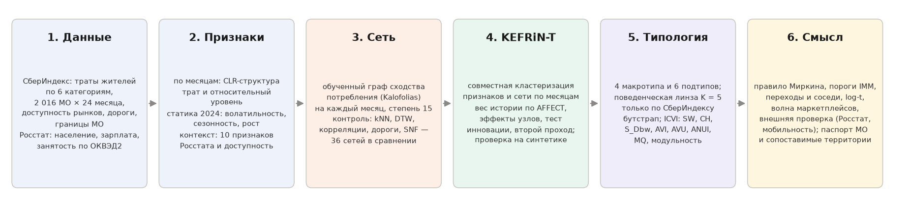
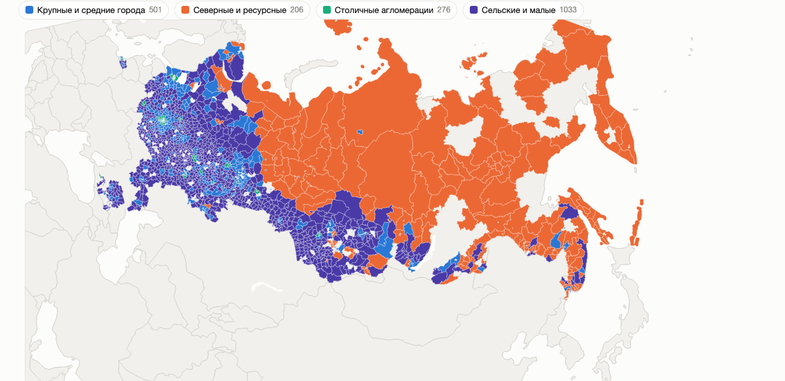
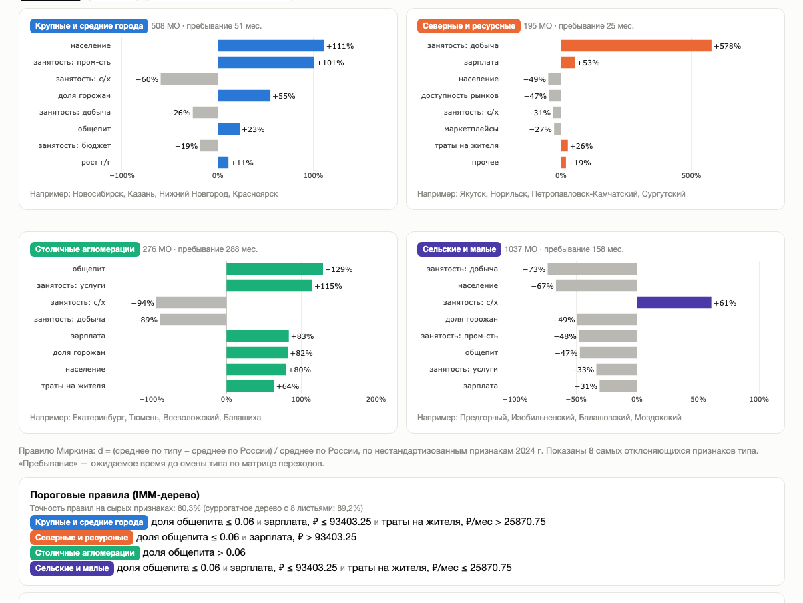
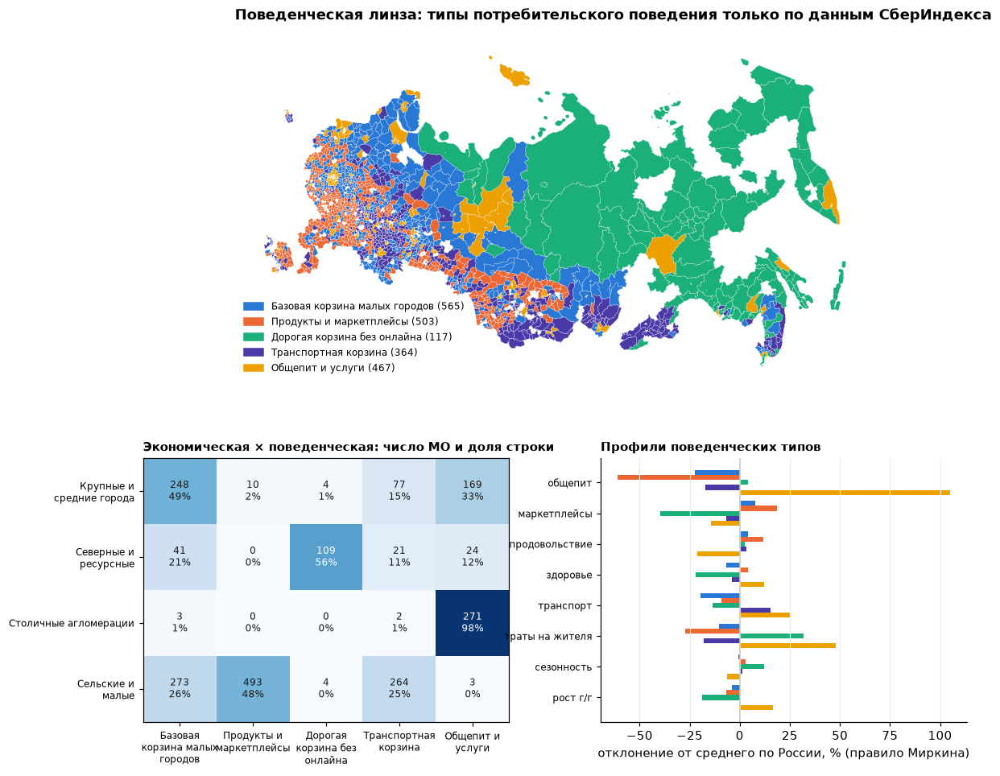
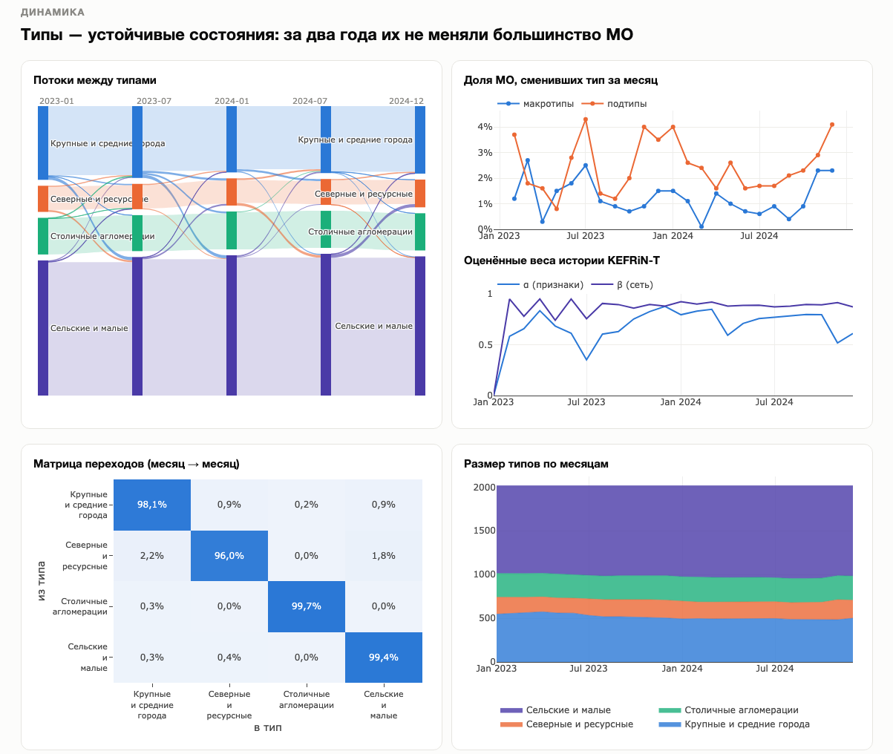
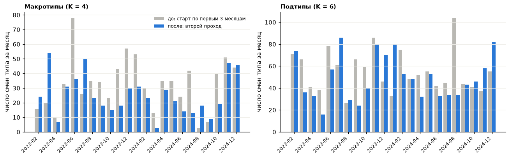
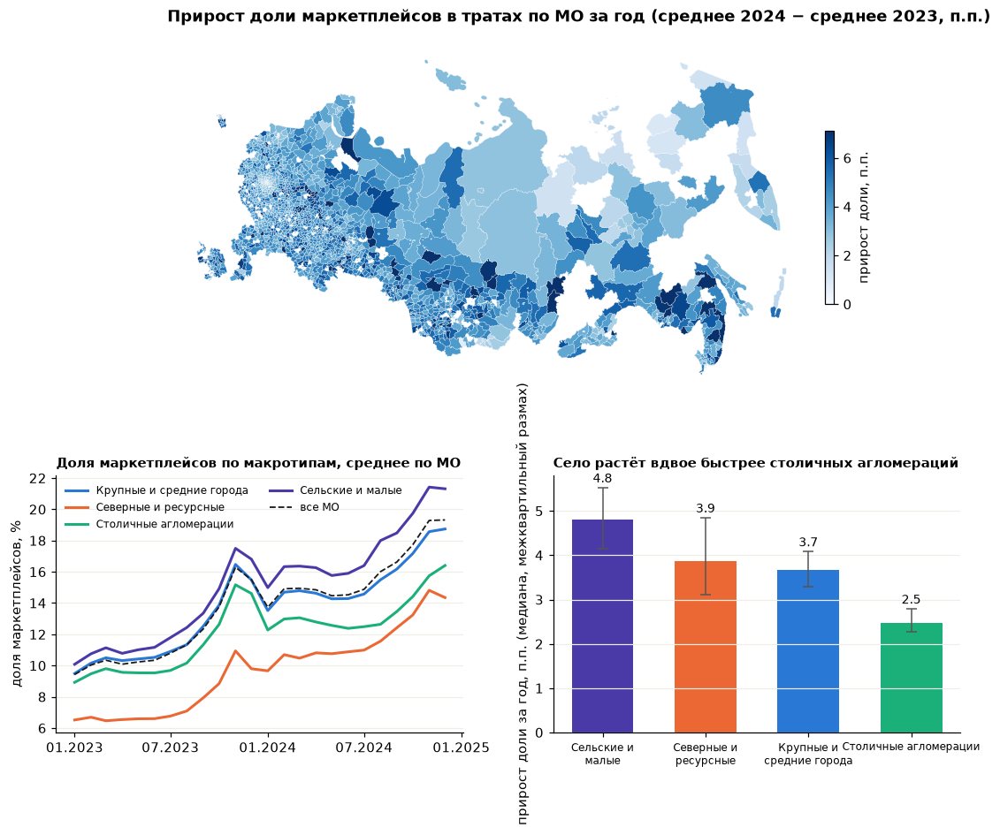

# Типы локальных экономик России по муниципальным данным СберИндекса: динамическая кластеризация на атрибутированных сетях

Методологический отчёт. Онлайн-конкурс СберИндекса 2026, направление «Кластеризация». Иван Фроловский.
Код, конфигурации и интерактивный лендинг — в репозитории проекта (`site/index.html`).

## 1. Коротко

- **Объект**: 2 016 муниципальных образований (МО) России с полной историей безналичных потребительских расходов жителей за 24 месяца (январь 2023 — декабрь 2024) по шести категориям трат; к ним привязаны Росстат (население, зарплата, структура занятости по ОКВЭД2), индекс доступности рынков и дорожные расстояния СберИндекса.
- **Сеть**: узел — МО, атрибуты — структура и уровень трат плюс контекст; рёбра — сходство потребительского поведения. Сравнены восемь правил ребра и пять способов разрежения; итоговая сеть — обученный граф (learning graphs from smooth signals), контроль — взаимный kNN.
- **Метод**: KEFRiN (Shalileh & Mirkin, 2022) — K-means, расширенный на feature-rich сети, — и его временное расширение **KEFRiN-T**: на каждом месяце кластеризуется сглаженный срез, вес истории оценивается по данным shrinkage-оценкой AFFECT (Xu, Kliger, Hero, 2014) с фиксированными эффектами узлов и тестом инновации. Метод проверен на синтетических динамических сетях с известной истиной.
- **Результат**: двухуровневая типология — 4 макротипа (крупные и средние города; северные и ресурсные; столичные агломерации; сельские и малые) и 6 подтипов. Макротипы воспроизводятся по бутстрапу с ARI 0,91–0,95, за два года макротип не меняли 89% МО; каждый тип объясняется тремя порогами (общепит ≤ 6% трат, зарплата ≤ 93 тыс. ₽, траты ≤ 25,9 тыс. ₽/мес) с точностью 80%.
- **Экономическое содержание**: типы различаются структурой трат (доля общепита от 1,6% у сельских до 7,8% у столичных), уровнем (21–47 тыс. ₽ на жителя в месяц), зарплатой (50–128 тыс. ₽) и доступностью рынков; переходы между типами зависят от типа соседей по дорожной сети; разброс уровней трат между МО за два года вырос (сходимости нет). Единственный большой сдвиг структуры — удвоение доли маркетплейсов (9,4% → 19,3%), причём село растёт вдвое быстрее столиц, а внутри сельского и северного типов доли сходятся.

- **Что нового**: (1) KEFRiN-T — эволюционное расширение метода жюри с оценкой веса истории по данным, фиксированными эффектами узлов и тестом инновации, проверенное на синтетике с известной истиной; (2) обученные из данных временные графы вместо ручного правила ребра, с полным сравнением 36 сетей; (3) две линзы — экономическая и чисто поведенческая — с прямым ответом, что в типологии от данных СберИндекса; (4) волна маркетплейсов как единственный большой сдвиг структуры трат и её география; (5) воспроизводимый пакет: один `make all`, контрольные прогоны с нуля, тесты.

| Критерий жюри | Где в отчёте | Главное |
|---|---|---|
| Объяснение методологии | схема ниже, §3, §5.1–5.2 | шесть шагов; KEFRiN-T словами и формулами |
| Сетевая и атрибутивная структура | §3, §4 | 8 правил ребра × 5 разрежений, обученный граф, лаги и DTW проверены |
| Сравнение методов | §5.3–5.5 | 12 методов на статике, 8 динамических вариантов, синтетика |
| ICVI | §5.4, §5.5, §10 | SW, CH, S_Dbw, AVI, AVU, ANUI, MQ, модульность; сверено с Pattern |
| Интерпретация, воспроизводимость | §6–9, §11 | пороги, профили, переходы, log-t, волна маркетплейсов, две линзы, `make all` |
| Визуализация | лендинг `site/index.html`, рис. 1–6 | карта по месяцам и линзам, потоки, паспорт МО, волна |

*Схема решения: шесть шагов от данных до интерпретации; каждому шагу соответствует раздел отчёта (§2–3, §4, §5, §6–7, §7–9).*

## 2. Данные

| Источник | Что взято | Ключ | Покрытие |
|---|---|---|---|
| СберИндекс, «Потребительские безналичные расходы на уровне МО» (архив хакатона Data → Sense, CC BY-SA 4.0) | оценка средних безналичных трат жителя в месяц, ₽; категории: продовольствие, здоровье, общественное питание, маркетплейсы, транспорт, все категории | `territory_id` | 2 190 МО, 2023-01…2024-12; 2 016 с полной историей |
| СберИндекс, индекс доступности рынков 2024 | относительный объём доступного внешнего рынка, 0–1000 | `territory_id` | 2 004 из 2 016 (99,4%) |
| СберИндекс, автодорожные связи между МО | расстояние по графу дорог между центрами МО, км | пары `territory_id` | 5,9 млн пар МО |
| СберИндекс, версионный справочник границ МО (CC BY-SA 4.0) | названия, тип и статус МО, регион, ОКТМО, центры, полигоны | `territory_id`, ОКТМО | все 2 016 (полигоны для карты) |
| Росстат, БД ПМО через «Если быть точным» (CC BY 4.0) | численность населения (в т. ч. городского), среднемесячная зарплата и среднесписочная численность по разделам ОКВЭД2 (без малых предприятий), годовые значения 2023–2024 | ОКТМО → `territory_id` | население 2 014 (99,9%), зарплата и занятость 1 996 (99,0%) |

Особенности данных, повлиявшие на решения: (1) в публичной API-выгрузке нет идентификатора ряда, одноимённые МО из разных регионов неразличимы — использован архив хакатона с `territory_id`; (2) в панели нет 12 регионов (Белгородская, Брянская, Курская, Воронежская, Ростовская области, Краснодарский край, Крым, Севастополь, Дагестан, Чечня, Ингушетия, Бурятия); (3) 24 месяца — один полный годовой цикл, поэтому годовые приросты доступны только за 2024 г.; (4) категория «прочее» = все категории − пять названных (медианная доля 28%). Медианные доли трат: продовольствие 44,8%, маркетплейсы 13,5%, транспорт 5,7%, здоровье 4,9%, общепит 2,6%.

## 3. Пространство признаков

**По месяцам** (7 признаков): CLR-координаты долей шести категорий (геометрия Айчисона для композиционных данных) и относительный уровень трат — логарифм трат минус медиана месяца по всем МО (снимает общероссийскую динамику и инфляцию). **Статический профиль 2024** (11): те же CLR, относительный уровень, его волатильность, сезонная амплитуда, средний прирост г/г, тренд доли маркетплейсов. **Контекст** (10): логарифмы населения, зарплаты, доступности рынков; доля городского населения; пять агрегированных долей занятости (сельское хозяйство; добыча; промышленность, энергетика и строительство; рыночные услуги; бюджетный сектор); признак городского округа. Стандартизация по столбцам с обрезкой хвостов на ±4σ (иначе доля добычи с 8,7σ доминирует в расстояниях). Для интерпретации все величины возвращаются в исходные единицы.

Обоснование: жюри в собственной работе о профилировании потребления использует композицию трат по категориям как основу сходства; мы дополняем её уровнем и динамикой, а контекст Росстата даёт экономический смысл типам и внешнюю валидацию.

## 4. Сетевая структура: правила ребра и разрежение

Сравнены восемь определений сходства между МО и пять способов разрежения (`scripts/edge_rules.py`, 36 сетей):

| Правило (разрежение — взаимный kNN15; обученный граф как есть) | Что измеряет | Ассортативность по атрибутным типам | Доля рёбер внутри региона |
|---|---|---|---|
| косинус z-профиля 2024 | похожесть структуры и уровня трат | 0,75 | 0,28 |
| корреляция месячных приростов (за вычетом медианы месяца) | со-движение | 0,51 | 0,26 |
| максимум корреляции по лагам ±2 | опережение/запаздывание | 0,45 | 0,21 |
| DTW относительного уровня (окно 3) | форма траектории уровня | 0,51 | 0,24 |
| 6-мерный DTW CLR-композиции | форма траектории структуры | 0,74 | 0,29 |
| дорожная гравитация exp(−d/200 км) | география | 0,43 | 0,78 |
| SNF-слияние (профиль + со-движение + география) | комбинация | 0,56 | 0,77 |
| обученный граф (Kalofolias 2016; параметризация 2019) | сглаженность признаков на графе | **0,80** | 0,37 |

Выводы. Правила из разных семейств почти не пересекаются по рёбрам (Жаккар 0,03–0,15): профиль, со-движение, форма траектории и география — разные отношения. Внутри семейства совпадение ожидаемо выше: дорожная гравитация и её SNF-слияние 0,51, корреляция приростов с лагом и без 0,39, косинус профиля и обученный граф 0,34. Со-движение приростов слабо связано со структурным типом МО; география и её слияние делают сеть региональной («типы = регионы»). Из разрежений глобальный порог по плотности дробит сеть на 1 300+ компонент, планарный TMFG даёт искусственно высокую модульность, disparity-фильтр почти не фильтрует; взаимный kNN15 и обученный граф — рабочие варианты.

**Решение**: сеть типологии строится по сходству потребительского поведения. Основной граф — обученный из гладких сигналов: min_W Σ_ij W_ij‖x_i − x_j‖² − α Σ_i log d_i + β‖W‖²_F при средней степени 15; в среднем 11 МО в месяц (0,5%) остаются изолятами и получают тип только по признакам. По месяцам граф обучается на сигналах каждого месяца (совпадение рёбер соседних месяцев 0,36 против 0,22 у kNN). На нём совместная кластеризация даёт модульность 0,56 против 0,51 на kNN при той же компактности. Корреляционные и дорожные сети используются отдельно: расстояния — для пространственной обусловленности переходов и «сопоставимых соседей». Опережение и запаздывание («один регион опережает другой») мы проверили лаговыми кросс-корреляциями месячных приростов уровня и доли маркетплейсов за вычетом общероссийской динамики: между средними рядами типов при лагах ±1–2 месяца корреляции не превышают 0,4 по модулю, а у 58–99% МО лучший лаг относительно своего типа равен нулю. На 24 месяцах устойчивых лидеров и последователей нет, поэтому лаговая сеть в типологии не используется.

Время-варьирующее обучение графа с регуляризацией изменений (Yamada, Tanaka, Ortega, 2020) проверено: при степени 15,6 совпадение рёбер соседних месяцев 0,42 и 1–2 изолята; разбиения на нём и на пооконных графах согласуются (AMI 0,90 по месяцам), а межмесячная устойчивость выше (0,97 против 0,93), но ценой более сглаженных сетей; оставлено как вариант в конфигурации. Для сравнения, согласие разбиений на обученном графе и на kNN — тоже 0,91.

## 5. Методы кластеризации

### 5.1. KEFRiN — совместная кластеризация признаков и сети
Модель восстановления данных: y_iv = Σ_k c_kv s_ik + f_iv (признаки), p_ij = Σ_k λ_kj s_ik + e_ij (строки сетевой матрицы). Критерий F = ρ Σ_i d(y_i, c_k(i)) + ξ Σ_i d(p_i, λ_k(i)) минимизируется чередованием: правило минимального совместного расстояния и пересчёт центров; инициализация K-means++/MaxMin; версии с евклидовым, косинусным и манхэттенским расстоянием. Сетевое представление узла — двухшаговая диффузия (T + T²)/2 по нормированной смежности, ξ уравнивает суммарный разброс двух пространств; карликовые кластеры (< 1% N) распускаются и пересеваются.

### 5.2. KEFRiN-T — эволюционная версия
На каждом месяце t кластеризуется сглаженный срез Ỹ_t = α_t Ỹ_{t−1} + (1 − α_t) Y_t, P̃_t = β_t P̃_{t−1} + (1 − β_t) P_t с тёплым стартом от S_{t−1} и венгерским выравниванием меток. Веса истории — shrinkage-оценка AFFECT: α* = Σ var(ε) / Σ[(x̃^{t−1} − E x)² + var(ε)], где E x берётся из модели KEFRiN. Наше расширение: **фиксированные эффекты узлов** E y_iv = c_k(i)v + u_iv (устойчивое отклонение МО от своего типа; в реальных данных разброс устойчивых эффектов 0,66 втрое больше месячного шума 0,28), робастная (винзоризованная) оценка шума и **тест инновации**: узел со стандартизованным остатком z_i > 2,5 получает α_i = 0, его накопленный эффект обнуляется — так настоящая смена типа проходит без задержки. Стартовое разбиение — по среднему первых трёх месяцев; затем **второй проход**: алгоритм запускается ещё раз со стартом от модальных (самых частых за 24 месяца) типов первого прохода. Это обычное уточнение к неподвижной точке: первый проход «усаживает» типологию в первые месяцы, второй убирает этот переходный процесс, не меняя модель (см. §8 и рис. 6).

### 5.3. Проверка на синтетических сетях с известной истиной
Генератор: 600 узлов, 5 сообществ, 12 месяцев; атрибуты y_it = μ_k + u_i + ε_it; сеть — стохастическая блочная модель с персистентностью рёбер 0,7; в месяц 6 мигрируют 15% узлов, фон 1%/мес. Сценарий «calibrated» повторяет реальные отношения шума, эффектов узлов и расстояний между центрами.

| Сценарий | Метод | NMI | мигранты верно через 0/1/2 мес. | ложные смены |
|---|---|---|---|---|
| калиброванный | **KEFRiN-T (эффекты узлов + сброс z > 2,5)** | **0,83** | **0,74 / 0,85 / 0,89** | **0,006** |
| калиброванный | KEFRiN-T (сброс z > 2,5), второй проход | 0,83 | 0,74 / 0,85 / 0,88 | 0,007 |
| калиброванный | KEFRiN-T (сброс z > 2,5), признаки сглажены скользящим средним 3 мес. | 0,81 | 0,50 / 0,85 / 0,88 | 0,014 |
| калиброванный | KEFRiN-T, сброс z > 4 | 0,82 | 0,51 / 0,72 / 0,82 | 0,006 |
| калиброванный | KEFRiN-T без сброса | 0,75 | 0,05 / 0,33 / 0,68 | 0,010 |
| калиброванный | AFFECT, блочная модель | 0,80 | 0,32 / 0,72 / 0,85 | 0,033 |
| калиброванный | фиксированное α = 0,5 | 0,80 | 0,34 / 0,72 / 0,85 | 0,032 |
| калиброванный | тёплый старт без сглаживания | 0,83 | 0,88 / 0,91 / 0,92 | 0,055 |
| калиброванный | K-means по месяцам | 0,70 | 0,85 / 0,86 / 0,86 | 0,115 |
| калиброванный | temporal Leiden, ω = 1 (только сеть) | 0,91 | 0,41 / 0,80 / 0,93 | 0,015 |
| низкий шум | KEFRiN-T (эффекты узлов + сброс z > 2,5) | 0,94 | 0,68 / 0,85 / 0,88 | 0,002 |
| низкий шум | тёплый старт без сглаживания | 0,94 | 0,96 / 0,99 / 0,98 | 0,033 |
| низкий шум | temporal Leiden, ω = 1 (только сеть) | 0,92 | 0,47 / 0,84 / 0,94 | 0,024 |
| шум ×2 | KEFRiN-T (эффекты узлов + сброс z > 2,5) | 0,76 | 0,19 / 0,30 / 0,36 | 0,010 |
| шум ×2 | KEFRiN-T (сброс z > 2,5), скользящее среднее 3 мес. | 0,85 | 0,20 / 0,57 / 0,70 | 0,010 |
| шум ×2 | фиксированное α = 0,5 | 0,86 | 0,31 / 0,82 / 0,92 | 0,035 |
| шум ×2 | AFFECT, блочная модель | 0,83 | 0,05 / 0,33 / 0,70 | 0,013 |
| шум ×2 | temporal Leiden, ω = 1 (только сеть) | 0,92 | 0,47 / 0,84 / 0,94 | 0,024 |

Средние по 5 сеансам генератора. «Низкий шум»: 8 признаков, σ центров 2, σ эффектов узла 1, σ шума 1; «шум ×2»: σ шума 2; «калиброванный»: 7 признаков, σ центров 0,78, σ эффектов 0,66, σ шума 0,28 — как в реальных данных.

Первая версия с фиксированными эффектами не замечала настоящих смен (8% мигрантов через два месяца): эффект узла поглощал смену, а оценка шума завышалась самими мигрантами — это и было исправлено робастной оценкой и тестом инновации. Два практических вывода из той же синтетики. Второй проход (старт от модальных типов первого прохода) на синтетике ничего не меняет — там нет переходного процесса, а на реальных данных он убирает всплеск смен первых месяцев (§8). Сглаживание признаков скользящим средним помогает только при сильном шуме (шум ×2: NMI 0,76 → 0,85), а при калиброванном шуме вносит запаздывание (мигранты в месяц события 0,74 → 0,50) и удваивает ложные смены, поэтому в основной конфигурации не используется. Оговорка: при сильном шуме атрибутов тест инновации почти перестаёт срабатывать, и адаптивная схема становится инерционной (мигранты через два месяца 0,36); там лучше фиксированное α = 0,5 (0,92) или чисто сетевой temporal Leiden (0,92, потому что сеть в синтетике не шумит). В реальных данных шум атрибутов мал (σ_ε 0,28 против разброса центров ≈ 0,8), режим соответствует калиброванному сценарию, а критичны как раз редкие ложные смены.

### 5.4. Сравнение методов на статическом срезе 2024 (обученный граф)

| Метод | K | SW | CH | S_Dbw | AVI | ANUI | MQ | Q | bootstrap-ARI (B = 10) |
|---|---|---|---|---|---|---|---|---|---|
| K-means | 4 | 0,199 | 430 | 0,80 | 0,82 | 0,57 | 3,29 | 0,56 | 0,94 |
| **KEFRiN (евклид)** | 4 | 0,196 | 429 | 0,82 | **0,84** | **0,58** | 3,35 | 0,56 | **0,95** |
| KEFRiN (косинус) | 4 | 0,192 | 416 | 0,81 | 0,82 | 0,56 | 3,29 | 0,56 | 0,88 |
| CANUS (Shalileh, 2025; код автора) | 4 | 0,193 | 372 | 0,85 | 0,78 | 0,53 | 3,12 | 0,52 | — |
| DMoN (Tsitsulin et al., 2023; GNN) | 4 | 0,101 | 353 | 0,80 | 0,88 | 0,56 | 3,54 | **0,63** | — |
| Ward | 4 | 0,190 | 376 | 0,81 | 0,73 | 0,52 | 2,93 | 0,48 | 0,57 |
| GMM | 4 | 0,157 | 324 | 0,76 | 0,68 | 0,48 | 2,72 | 0,44 | 0,94 |
| KEFRiN (косинус) | 6 | 0,117 | 310 | 0,78 | 0,79 | 0,55 | 4,71 | 0,62 | 0,70 |
| KEFRiN (евклид) | 6 | 0,144 | 330 | 0,78 | 0,75 | 0,53 | 4,48 | 0,58 | 0,77 |
| DMoN (GNN) | 6 | 0,091 | 275 | 0,75 | 0,85 | 0,57 | 5,11 | **0,68** | — |
| Leiden, модульность (res 1 / 0,5) | 39 / 31 | 0,01 / 0,04 | 54 / 54 | 0,48 / 0,41 | 0,66 / 0,64 | 0,59 / 0,60 | 26 / 20 | **0,75 / 0,70** | 0,43 / 0,44 |
| iLouvain (CDlib) | 21 | −0,04 | 38 | 0,26 | 0,51 | 0,47 | 10,6 | 0,55 | — |
| EVA (CDlib, квартильные категории) | 251 | −0,21 | 7 | 0,06 | 0,09 | 0,09 | 22,4 | 0,66 | — |
| спектральная по графу | 4 | 0,066 | 10 | 0,58 | — | — | — | 0,01 | вырождается |

CANUS и DMoN (PyTorch, Adam) при фиксированном seed воспроизводятся между запусками с точностью ±0,01 по индексам из-за недетерминизма многопоточных операций; остальные методы детерминированы. Совместные least-squares методы дают лучший компромисс между компактностью в пространстве признаков и связностью на сети; чисто сетевые максимизируют модульность ценой дробления на 21–251 сообществ без компактности; DMoN — графовая нейросеть, максимизирующая модульность (реализация по статье, `src/mo_types/dmon.py`), — даёт самую высокую модульность среди методов с заданным K (0,63 при K = 4, 0,68 при K = 6) при вдвое худшей компактности (SW 0,10 против 0,20): та же дилемма «сеть или признаки», что и у Leiden, только с фиксированным K. Это согласуется с выводом Passos, Carlini и Trani (2024) о том, что сложные сетевые и глубокие методы не выигрывают у простых на атрибутированных временных графах.

### 5.5. Динамические варианты (24 месячных среза, обученные графы, второй проход для всех вариантов)

| Вариант | K | AMI соседних месяцев | смена типа/мес. | макс. | МО без смен | SW | Q |
|---|---|---|---|---|---|---|---|
| тёплый старт без сглаживания | 4 | 0,903 | 2,3% | 3,6% | 86% | 0,231 | 0,54 |
| фиксированное α = 0,5 | 4 | 0,951 | 1,1% | 1,9% | 89% | 0,232 | 0,54 |
| AFFECT (блочная модель) | 4 | 0,943 | 1,2% | 2,5% | 89% | 0,232 | 0,54 |
| KEFRiN-T без сброса | 4 | 0,971 | 0,6% | 2,9% | 90% | 0,229 | 0,53 |
| **KEFRiN-T (итог)** | 4 | 0,949 | 1,1% | 2,7% | 89% | 0,231 | 0,53 |
| тёплый старт | 6 | 0,855 | 5,4% | 7,1% | 69% | 0,165 | 0,54 |
| **KEFRiN-T (итог)** | 6 | 0,932 | 2,3% | 4,3% | 77% | 0,167 | 0,52 |
| temporal Leiden, ω = 2 (только сеть) | 5 | 0,993 | 0,1% | 0,3% | 97% | 0,157 | 0,55 |

Итоговый вариант выбран не по максимальной стабильности (её легко получить, запретив смены), а по синтетической проверке: он сочетает низкую долю ложных смен с быстрым обнаружением настоящих. Оценённые веса (со второго месяца; в январе 2023 истории ещё нет, оба веса равны нулю): α_t 0,35–0,88 (медиана 0,75) для признаков, β_t 0,74–0,95 (медиана 0,89) для сети: месячные графы шумнее признаков. Полностью сетевой temporal Leiden на обученных графах находит ровно 5 сообществ с почти неизменным составом — сама обученная сеть имеет ясную модульную структуру; но его разбиение не учитывает контекст и хуже по SW. Что именно находит сеть без признаков (`scripts/network_view.py`): пять сообществ — столичные агломерации (260 из 276 в одном сообществе, чистота 0,87), Север (95 из 195, чистота 0,90), «городское» сообщество (190 городов, доля горожан 0,9) и большое «сельско-полугородское» (1 322 МО: 990 сельских и 271 город, медианная доля горожан 0,4) плюс 14 удалённых районов. Согласие с макротипами AMI 0,48, с подтипами 0,41: сеть сходства потребления сама выделяет столицы и Север, а границу между селом и малыми городами не проводит — её задаёт контекст Росстата. Это ещё один аргумент за совместную кластеризацию признаков и сети вместо любой из половин.

## 6. Выбор числа типов

Bootstrap-устойчивость (20 подвыборок по 80% МО, статический срез, обученный граф): K = 4 — ARI 0,91, минимальный покластерный Жаккар 0,83 (по Hennig, 2007: > 0,75 — устойчивый паттерн, > 0,85 — высокоустойчивый; три типа из четырёх выше 0,85); K = 5 — 0,81; K = 6 — 0,74 (нестабильны пограничные типы, Жаккар 0,64–0,71); от K = 7 устойчивость совместного критерия падает до 0,57. Индексы качества монотонно убывают с K (SW 0,20 → 0,14, CH 429 → 330), S_Dbw и MQ не дают внутреннего максимума. Поэтому типология двухуровневая: 4 макротипа как устойчивое ядро и 6 подтипов как содержательное уточнение с оговоркой о границах. Кросс-таблица показывает вложенность: города = региональные центры + полугородские промышленные; северные = ресурсные центры + удалённые районы Востока и Сибири; столичные агломерации = один подтип; сельские = сельские и малые + часть полугородских промышленных.

## 7. Типы и их экономическое содержание

Профили по правилу Миркина (Alvandyan & Shalileh, 2024): d = (среднее по типу − среднее по России)/среднее по России на нестандартизованных признаках.

*Рис. 1. Макротипы МО на декабрь 2024 г. Четыре типа образуют устойчивые пояса: столичные агломерации и региональные центры внутри сельского пояса европейской России и юга Сибири, северный и ресурсный пояс от Кольского полуострова до Чукотки.*

| Макротип | МО | Траты, ₽/мес (медиана) | Общепит | Продовольствие | Население | Зарплата, ₽ | Доступность рынков | Отличительная занятость |
|---|---|---|---|---|---|---|---|---|
| Крупные и средние города | 508 | 29 295 | 4,1% | 41% | 56 тыс. | 68 898 | 322 | промышленность +101% |
| Северные и ресурсные | 195 | 34 491 | 3,4% | 43% | 21 тыс. | 111 491 | 149 | добыча ×6,8 |
| Столичные агломерации | 276 | 46 751 | 7,8% | 32% | 77 тыс. | 127 498 | 561 | рыночные услуги +115% |
| Сельские и малые | 1 037 | 21 352 | 1,6% | 47% | 16 тыс. | 50 273 | 318 | сельское хозяйство +61% |

- **Крупные и средние города** (Новосибирск, Казань, Нижний Новгород, Красноярск): население +111% к среднему, доля горожан +55%, промышленность +101%, траты около средних (+5%), общепит +23%.
- **Северные и ресурсные** (Якутск, Петропавловск-Камчатский, Сургутский район, Нефтеюганск): добыча +578%, зарплата +53%, траты +26%, доступность рынков −47%, маркетплейсы −27% (логистика), здоровье −19%.
- **Столичные агломерации** (Москва и Санкт-Петербург с внутригородскими территориями, Подмосковье, Екатеринбург, Тюмень): общепит +129%, траты +64%, зарплата +83%, доступность рынков +60%, продовольствие −26% — закон Энгеля в чистом виде.
- **Сельские и малые** (половина панели): продовольствие +9%, общепит −47%, траты −24%, население −67%, зарплата −31%, сельское хозяйство +61%, бюджетная занятость +21%.

Подтипы добавляют: **удалённые районы Востока и Сибири** (152; доступность рынков −48%, транспорт +15%, сезонность +14%, маркетплейсы −26%), **северные ресурсные центры** (116; добыча ×11,8, зарплата +70%), **региональные центры** (313; население +212%, промышленность +118%), **полугородские промышленные районы** (486; профиль близок к среднему, промышленность +28%).

*Рис. 2. Восемь самых отклоняющихся признаков каждого макротипа (правило Миркина, % к среднему по России) и пороговые правила IMM-дерева.*

Пороговые правила IMM-дерева (Dasgupta et al., 2020) на сырых признаках объясняют макротип с точностью 80%: столичные агломерации — доля общепита > 6%; северные и ресурсные — общепит ≤ 6% и зарплата > 93,4 тыс. ₽; города — общепит ≤ 6%, зарплата ≤ 93,4 тыс. ₽ и траты > 25,9 тыс. ₽/мес; сельские и малые — остальное. Суррогатное дерево с 8 листьями воспроизводит 89% меток.

Внешняя валидация: типы объясняют 74% дисперсии уровня трат, 64% зарплаты, 58% доступности рынков (η²); согласие с административным типом МО умеренное (ARI 0,37), с регионом — слабое (0,04): типология не повторяет ни административную сетку, ни регионы. Независимый набор СберИндекса, не участвовавший в кластеризации, — индекс покупательской мобильности (км, конец 2024 г.; 270 из 297 МО сопоставлены по названию, `scripts/mobility_check.py`) — различает типы так же резко: медианы 4,8 км у столичных агломераций, 1,1 у городов, 0,9 у северных, 0,5 у сельских (η² = 0,51, тест Краскела–Уоллиса p < 10⁻³⁰).

### 7.4. Вторая линза: типы потребительского поведения только по данным СберИндекса

Экономическая типология выше строится на потреблении вместе с контекстом Росстата. Отсюда вопрос: что в ней от данных СберИндекса? Статическая KEFRiN на тех же графах даёт: полные признаки — ARI 0,86 с итоговыми макротипами, только контекст (население, зарплата, занятость, доступность) — 0,71, только потребление — 0,44. Потребление само по себе безошибочно выделяет столичные агломерации (97% МО типа) и село (74%), но не разделяет города и Север: их различает контекст. Поэтому мы добавляем вторую линзу — **поведенческую типологию** тем же методом (KEFRiN-T на обученных графах), но только по семи месячным признакам потребления: CLR-структура шести категорий и относительный уровень трат (`scripts/two_lenses.py`, `outputs/two_lenses/`).

Число типов — 5: по бутстрапу это единственное устойчивое решение (ARI 0,86, минимальный Жаккар 0,84 против 0,82 при K = 4 и 0,67 при K = 6). Поведенческие типы менее устойчивы во времени, чем экономические (46% МО без смен за два года против 89%, смена типа 6,1% в месяц): без контекста, который не меняется, типы «дышат» вместе с сезоном и волной маркетплейсов. Пороговые правила на сырых долях объясняют их с точностью 74% (суррогатное дерево с 10 листьями — 80%): общепит > 5% — «общепит и услуги»; иначе маркетплейсы ≤ 12% — «дорогая корзина без онлайна»; иначе транспорт > 6% — «транспортная корзина»; иначе доля прочего > 24% — «базовая корзина малых городов», ≤ 24% — «продукты и маркетплейсы».

*Рис. 5. Поведенческая линза (только СберИндекс): карта пяти типов потребления, кросс-таблица с экономической типологией (число МО и доля строки), профили по правилу Миркина.*

| Поведенческий тип | МО | Общепит | Маркетплейсы | Продовольствие | Транспорт | Траты, % к среднему | Примеры |
|---|---|---|---|---|---|---|---|
| Общепит и услуги | 467 | +105% | −14% | −21% | +25% | +48% | Новосибирск, Екатеринбург, Казань, Нижний Новгород |
| Базовая корзина малых городов | 565 | −22% | +8% | +4% | −20% | −11% | Орск, Белово, Муром, Димитровград |
| Продукты и маркетплейсы | 503 | −61% | +19% | +12% | −9% | −27% | Изобильненский, Кочубеевский, Петровский округа |
| Транспортная корзина | 364 | −17% | −7% | +3% | +15% | −18% | Курган, Балаково, Бийск, Златоуст |
| Дорогая корзина без онлайна | 117 | +4% | −40% | +3% | −13% | +32% | Якутск, Комсомольск-на-Амуре, Норильск, Магадан |

Две линзы согласуются лишь частично (ARI 0,28, AMI 0,41), и именно расхождения содержательны. Столичные агломерации почти целиком (271 из 276) попадают в «общепит и услуги», а северные и ресурсные — в «дорогую корзину без онлайна» (109 из 195): для этих типов экономика и поведение совпадают. Крупные и средние города делятся между «общепитом и услугами» (169) и «базовой корзиной» (248): половина городов по потреблению живёт как малые города. Сельский тип распадается на три корзины: «продукты и маркетплейсы» (493, чистота 98% — это самое сельское потребление в стране), «базовая» (273) и «транспортная» (264) — сельские районы вдоль трасс и с высокой долей расходов на топливо. Итог для интерпретации: экономическая линза отвечает на вопрос «какая это территория», поведенческая — «как здесь тратят», и вторая не выводится из первой.

## 8. Динамика типов

*Рис. 3. Потоки между макротипами по полугодиям, доля МО, сменивших тип за месяц, оценённые веса истории α_t и β_t, месячная матрица переходов и размеры типов.*

- **Чистка динамики: второй проход.** Первый проход стартует с разбиения по среднему первых трёх месяцев, и типология «усаживается» несколько месяцев: согласие меток января–марта 2023 с модальным типом 0,82, всплеск 78 смен в июне 2023 (Казань, Уфа, Владивосток, Хабаровск переходят из столичного типа в города — граница инициализации, а не экономика). Второй проход со стартом от модальных типов первого прохода убирает переходный процесс, не меняя модель: смен за два года 752 → 579 (−23%), июнь 2023 — 78 → 36, ноябрь–декабрь в среднем 49 → 35, остальные месяцы 28 → 23; согласие первых месяцев с модальным типом 0,82 → 0,85; модальный тип не изменился у 98,9% МО (ARI 0,97). Остаточная сезонность сохраняется: ноябрь–декабрь дают в полтора раза больше смен, чем лето (новогодний сдвиг структуры трат); сглаживание признаков скользящим средним её убирает, но по синтетике вносит запаздывание и ложные смены при низком шуме (§5.3), поэтому не применено (`scripts/dynamics_cleanup.py`, `outputs/dynamics_cleanup/`).

*Рис. 6. Число смен типа по месяцам до (старт по первым трём месяцам) и после второго прохода: макротипы и подтипы.*

- **Устойчивость**: диагональ матрицы месячных переходов 0,96–0,997 (ожидаемое пребывание от 25 месяцев у северных до десятков лет у столичных); 89% МО не меняли макротип ни разу; смены сосредоточены в пограничных сельских районах и малых городах.
- **Пространственная обусловленность** (Spatial Markov, 8 ближайших МО по дорожной сети): если соседи — северные и ресурсные, вероятность перейти в этот тип 39% против базовой 0,4% (оценка на малом числе смен); для городов 2,7% против 0,9%. Смена типа — не изолированное событие, а движение вместе с окружением.
- **Сходимости уровней нет**: тест log-t Phillips–Sul отвергает сходимость и в целом (b = −0,77, t = −28,7), и внутри каждого типа; дисперсия относительных уровней H_t выросла с 0,10 в январе 2023 до 0,13 в 2024 г., std логарифма уровня — с 0,29 до 0,33. Оговорка: рост может отражать неравномерное проникновение безналичных платежей.
- **Кейсы шоков**: паводок в Орске (ЧС федерального уровня, апрель 2024) не изменил тип города; относительно медианы типа уровень трат в апреле −0,01, в мае +0,05 (выплаты), затем возврат к норме. Приграничные регионы в панели отсутствуют.

## 9. Волна маркетплейсов: единственный большой сдвиг структуры трат

Типы устойчивы, но внутри них структура трат за два года изменилась в одном направлении: доля маркетплейсов удвоилась. Это единственный сдвиг такого масштаба в данных, и он не разрушает типологию, потому что идёт во всех типах сразу (`scripts/marketplace_wave.py`, `outputs/marketplace_wave/`).

*Рис. 4. Прирост доли маркетплейсов за год по МО (среднее 2024 − среднее 2023), доля по макротипам по месяцам и прирост по типам (медиана и межквартильный размах).*

- **Масштаб.** Средняя по МО доля маркетплейсов выросла с 9,4% в январе 2023 до 19,3% в декабре 2024 (взвешенно по населению 8,8% → 17,4%); пик 2023 года — ноябрь, в 2024-м максимум сместился на декабрь. Медианный прирост среднегодовой доли 4,1 п.п., отрицательного прироста нет ни у одного МО. Доля продовольствия за то же время снизилась с 44,6% до 41,6%, общепита — с 3,5% до 2,8%.
- **Догоняющий рост.** Прирост тем больше, чем меньше население, ниже зарплата и доля горожан и чем ниже стартовая доля: сельские и малые МО +4,8 п.п. в год, северные +3,9, города +3,7, столичные агломерации +2,5 (медианы). Сельские МО уже в 2023 г. тратили на маркетплейсах больше столиц (12,6% против 10,6%), а в 2024 г. — 17,5% против 13,1%: онлайн замещает отсутствующую офлайн-торговлю. Корреляция прироста доли с приростом доли продовольствия −0,39: маркетплейсы забирают долю прежде всего у продовольственного ретейла.
- **Доступность рынков не объясняет волну.** В регрессии прироста на логарифмы доступности, населения, зарплаты, долю горожан, стартовую долю и тип коэффициент при доступности +0,23 п.п. (t = 2,1), а с фиксированными эффектами регионов −0,88 (t = −3,6); только по сельским МО +0,51 (t = 2,7) и +0,23 (t = 0,4) с эффектами регионов. Знак зависит от спецификации, поэтому эффект дорожной доступности мы не считаем установленным; устойчивы эффекты населения (−0,3…−0,7 п.п. на единицу логарифма), урбанизации (−0,6…−0,8) и стартовой доли (−0,1…−0,2 п.п. на 1 п.п.). R² 0,47 без и 0,60 с региональными эффектами.
- **Два полюса отставания.** Медленнее всего доля растёт там, где доставки нет, и там, где она не нужна: арктические районы Якутии и Чукотки (доля 3–5% в 2024 г., прирост 1–1,7 п.п.) и центральные районы Москвы (Тверской, Якиманка, Хамовники, Арбат: около 10%, прирост 1,6–1,7 п.п.). Лидеры — отдалённые сельские районы Сибири и Дальнего Востока с низкой стартовой долей: Мотыгинский район Красноярского края 4,6% → 19,5%, Солтонский район Алтайского края 5,2% → 17,5%, Усть-Ишимский район Омской области 4,9% → 16,2%.
- **Клубная сходимость.** Разброс доли между всеми МО вырос с 2,7 до 4,1 п.п. (std), но внутри типов он не растёт (село 3,2 → 3,1 п.п., города 2,4 → 2,5). Тест log-t по доле маркетплейсов отвергает сходимость по всей панели (b = −0,25, t = −6,2) и внутри городов и столичных агломераций, но не отвергает её внутри сельского (b = 0,09) и северного (b = −0,08) типов: типы расходятся между собой, а внутри двух самых массовых типов доли сближаются. Типология, таким образом, задаёт клубы сходимости и для структуры трат.

## 10. Индексы качества (ICVI)

Признаковое пространство: SW (silhouette), CH (Calinski–Harabasz), S_Dbw (Halkidi & Vazirgiannis). Сетевое: AVI, AVU, ANUI (Biswas & Biswas, 2017), MQ (Mancoridis et al., 1998, взвешенный TurboMQ), модульность Ньюмана и density modularity. Реализация AVU/AVI/ANUI/модульности сверена с библиотекой Pattern (тест `tests/test_metrics.py`). Итоговая типология: K = 4 — SW 0,23, CH 491, S_Dbw 0,80, AVI 0,81, AVU 0,52, ANUI 0,57, MQ 3,23, Q 0,53 (средние по 24 месяцам); K = 6 — SW 0,17, CH 387, S_Dbw 0,76, AVI 0,68, ANUI 0,51, MQ 4,08, Q 0,52.

## 11. Воспроизводимость

`make env` создаёт окружение (Python 3.12, `requirements.txt`, graph-learning из git), `scripts/download_data.py` скачивает все источники (с проверкой sha256; показатели Росстата извлекаются из больших архивов по HTTP Range), `make all` прогоняет пайплайн от панели до лендинга и отчёта (`scripts/build_report.py` собирает этот документ из `report/methodology.md`); все гиперпараметры — в `configs/base.yaml` и `configs/types.yaml`; seed = 42. Два контрольных прогона с нуля (21.09.2026, 26 и 40 мин на Apple M-серии) воспроизвели итоговые метки типов, интерпретацию, волну маркетплейсов и обе линзы побайтно; во втором прогоне из 151 файла результатов 142 совпали полностью, остальные отличались только временем счёта и индексами CANUS/DMoN в третьем знаке. В первом прогоне статический обученный граф отличался на ±2 ребра (солвер graph-learning), поэтому сравнительные таблицы §5.4 и §6 могут меняться в третьем знаке, bootstrap-ARI — до ±0,03. Проприетарные платные технологии не используются; все пакеты открытые.

## 12. Ограничения и что дальше

24 месяца — короткий горизонт для сезонности и для теста сходимости; в панели нет 12 регионов; значение расходов — модельная оценка СберИндекса (порог качества), а «прочее» — остаток. Для продолжения: обучение графа с учётом контекста (расстояния между МО по признакам Росстата), нелинейное сходство (представления TS2Vec), проверка типологии на данных 2025 г. (out-of-time), поиск лидеров и последователей на более длинных рядах (на 24 месяцах лаговые корреляции не дали сигнала, §4).

## Литература

Shalileh S., Mirkin B. Community partitioning over feature-rich networks using an extended K-means method. Entropy, 2022. · Shalileh S., Antonov E., Tsyplakova D. Profiling consumption using attributed network clustering. Complex Networks & Their Applications XIV, 2026. · Shalileh S. A filtered gradient descent clustering method to recover communities in attributed networks. IEEE Access, 2025. · Alvandyan T., Shalileh S. An empirical scrutinization of four crisp clustering methods with four distance metrics and one straightforward interpretation rule. Doklady Mathematics, 2024. · Xu K., Kliger M., Hero A. Adaptive evolutionary clustering. Data Mining and Knowledge Discovery, 2014. · Chakrabarti D., Kumar R., Tomkins A. Evolutionary clustering. KDD, 2006. · Kalofolias V. How to learn a graph from smooth signals. AISTATS, 2016; Kalofolias V., Perraudin N. Large scale graph learning from smooth signals. ICLR, 2019. · Yamada K., Tanaka Y., Ortega A. Time-varying graph learning with constraints on graph temporal variation. 2020. · Mucha P. et al. Community structure in time-dependent, multiscale, and multiplex networks. Science, 2010. · Rossetti G., Cazabet R. Community discovery in dynamic networks: a survey. ACM Computing Surveys, 2018. · Biswas A., Biswas B. Defining quality metrics for graph clustering evaluation. Expert Systems with Applications, 2017. · Halkidi M., Vazirgiannis M. Clustering validity assessment. ICDM, 2001. · Mancoridis S. et al. Using automatic clustering to produce high-level system organizations of source code. 1998. · Dasgupta S., Frost N., Moshkovitz M., Rashtchian C. Explainable k-means and k-medians clustering. ICML, 2020. · Hennig C. Cluster-wise assessment of cluster stability. CSDA, 2007. · Phillips P., Sul D. Transition modeling and econometric convergence tests. Econometrica, 2007. · Rey S. Spatial empirics for economic growth and convergence. Geographical Analysis, 2001. · Wang B. et al. Similarity network fusion. Nature Methods, 2014. · Serrano M. et al. Extracting the multiscale backbone of complex weighted networks. PNAS, 2009. · Passos N., Carlini E., Trani S. Deep community detection in attributed temporal graphs: experimental evaluation. GNNet, 2024.
